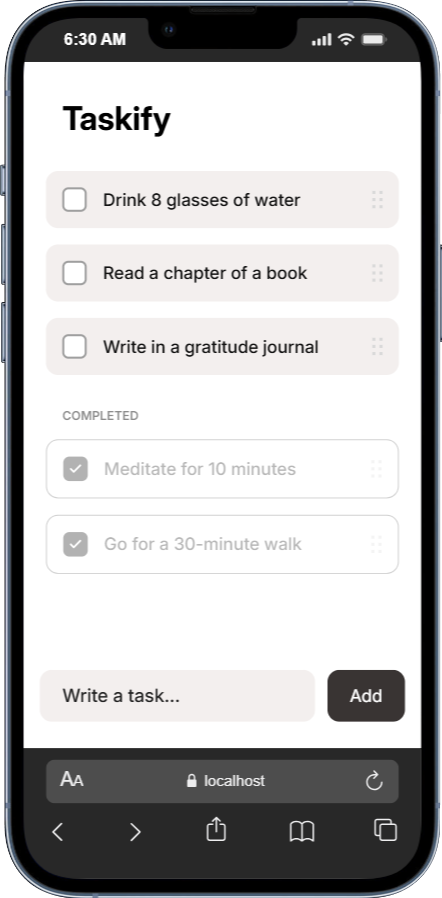

<div align="center">
<a href="https://github.com/fahmirizalbudi/taskify" target="blank">

</a>
<br/>

<br />
<br />


</div>

<br />

## Taskify

Taskify is a mobile-first Progressive Web App (PWA) designed for efficient task management. Built with Astro, it delivers lightning-fast performance and a seamless native-app-like experience directly from the browser. Key features include:

## Preview

<p align="center">
  
</p>

## Features

- **Mobile First:** Optimized UI/UX specifically for mobile devices.
- **PWA Support:** Installable on devices with offline capabilities.
- **Task Management:** Create, organize, and track your daily tasks effortlessly.
- **High Performance:** Zero-javascript default architecture powered by Astro.

## Tech Stack

- **Astro**: An all-in-one web framework for building fast, content-focused websites.
- **PWA**: Progressive Web App technologies for offline support and installability.

## Getting Started

To get a local copy of this project up and running, follow these steps.

### Prerequisites

- **Node.js** & **NPM**.

## Installation

1. **Clone the repository:**

   ```bash
   git clone https://github.com/fahmirizalbudi/taskify.git
   cd taskify
   ```

2. **Install dependencies:**

   ```bash
   npm install
   ```

3. **Start the development server:**

   ```bash
   npm run dev
   ```

## Usage

### Running the Application

- **Development mode:** `npm run dev`.
- **Production mode:** `npm run build`.

> Open [http://localhost:4321](http://localhost:4321) to view it in the browser.

## License

All rights reserved. This project is for educational purposes only and cannot be used or distributed without permission.
